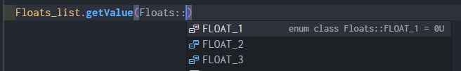
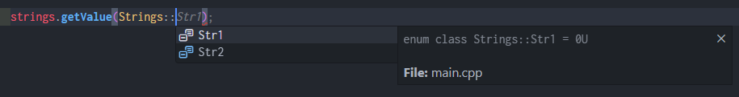

<h1 align="center">
  <a></a>
  <br>
  SettingsManagerESP32
</h1>

<p align="center">
  <b>Manage your ESP32 Preferences easily!</b>
</p>

[](https://www.ardu-badge.com/SettingsManagerESP32)
[](https://registry.platformio.org/libraries/alkonosst/SettingsManagerESP32)

---

# Table of contents <!-- omit in toc -->

- [Description](#description)
- [Usage](#usage)
  - [Adding library to Arduino IDE](#adding-library-to-arduino-ide)
  - [Adding library to platformio.ini (PlatformIO)](#adding-library-to-platformioini-platformio)
  - [Using the library](#using-the-library)
    - [Including the library](#including-the-library)
    - [What is inside the library](#what-is-inside-the-library)
  - [Constructors and initialization](#constructors-and-initialization)
    - [Step 1: Defining your settings in a macro](#step-1-defining-your-settings-in-a-macro)
    - [Step 2: Creating `enum class` and `settings list` (manual)](#step-2-creating-enum-class-and-settings-list-manual)
    - [Step 2 alternative: Creating `enum class` and `settings list` (automatic)](#step-2-alternative-creating-enum-class-and-settings-list-automatic)
    - [Example](#example)
  - [Setting types](#setting-types)
  - [Important notes](#important-notes)

---

# Description

Manage your ESP32 device preferences effortlessly with the **SettingsManagerESP32** library. This
powerful yet user-friendly library abstracts away the complexities of dealing with ESP32
Non-Volatile Storage, providing you with a seamless and intuitive interface to store and retrieve
your device settings.

Some of the core features are:

- Single place to manage a list of settings in your code.
- Capable of having a **Key**, **Description Text** (_hint_) and a **Default Value** for each setting. All
  these values stored in flash, no use of the heap.
- No need to use a key string to access a setting (_default case in the Preferences library_).
- Use of automatically created enum class to index your settings.
- Perfect use with a IDE with autocompletion, like VSCode. See example below.




# Usage

## Adding library to Arduino IDE

Search for the library in the Library Manager.

## Adding library to platformio.ini (PlatformIO)

```ini
; Most recent changes
lib_deps =
  https://github.com/alkonosst/SettingsManagerESP32.git

; Release vx.y.z (using an exact version is recommended)
lib_deps =
  https://github.com/alkonosst/SettingsManagerESP32.git#v2.0.0
```

## Using the library

### Including the library

First, include the library in your file:

```cpp
#include "SettingsManagerESP32.h"
```

By default, there are two definitions which controls the maximum size for **strings** and
**byte-streams**, which are `SETTINGS_STRING_BUFFER_SIZE` and `SETTINGS_BYTE_STREAM_BUFFER_SIZE`
respectively, **both set to 32 bytes**. If you need to change these values, you can do it in your code
before including the library:

```cpp
#define SETTINGS_STRING_BUFFER_SIZE 64
#define SETTINGS_BYTE_STREAM_BUFFER_SIZE 64
#include "SettingsManagerESP32.h"
```

Or if using PlatformIO, you can add these definitions in your `platformio.ini` file:

```ini
build_flags =
  -D SETTINGS_STRING_BUFFER_SIZE=64
  -D SETTINGS_BYTE_STREAM_BUFFER_SIZE=64
```

### What is inside the library

The library creates a ESP32 `Preferences` object to manage the non-volatile storage named `nvs`. You can use
this object, if needed, to access de NVS directly:

```cpp
Preferences nvs;
```

All the relevant classes and types are inside the `NVS` namespace. The available classes are:

- `Settings<T, ENUM>`: Main class to manage settings. `T` is the type of the setting and `ENUM` is the enum
  class to index the settings. The available types are: `bool`, `uint32_t`, `int32_t`, `float`,
  `double`, `const char*` and `ByteStream`.
- `ISettings`: Interface class to manage settings via pointer. You can use this class to create a
  pointer to a particular `Settings` object.

And the available types are:

- `ByteStream`: Class to manage byte streams. It is used to store raw binary data in the NVS.
- `Type`: Enum class to define the type of the setting object, which can be `Bool`, `UInt32`, `Int32`,
  `Float`, `Double`, `String` or `ByteStream`.

## Constructors and initialization

This library makes use of [X-Macros](https://en.wikipedia.org/wiki/X_macro) to make the code
maintainable and escalable. You can easily add, edit or remove a setting in the same place.

### Step 1: Defining your settings in a macro

In order to create a new group of settings, you need to define a macro with the following structure:

```cpp
#define FLOATS(X) \
  X(SenThr,   "Sensor Voltage Threshold", 3.14,   false) \
  X(AdcSlope, "ADC Slope Factor",         1.2345, true)  \
  X(Another,  "Another setting",          0.0,    false)
```

Structure of the macro:

|      | First (key)                                                                                    | Second (hint)                           | Third (default value)                                         | Fourth (formatteable)       |     |
| ---- | ---------------------------------------------------------------------------------------------- | --------------------------------------- | ------------------------------------------------------------- | --------------------------- | --- |
| `X(` | Enum class member, also used as a key (**no more than 15 characters** and **no whitespaces**). | Text to describe what the setting does. | Default value. In the example above, a value of type `float`. | Setting formatteable or not | `)` |

Each new row is a new setting. All settings in the same macro must be of the same
type. In the example above all settings are `float`.

### Step 2: Creating `enum class` and `settings list` (manual)

Once you have defined your settings, you need to create an `enum class` and a `settings list` object. You must use the
macros `SETTINGS_EXPAND_ENUM_CLASS` and `SETTINGS_EXPAND_SETTINGS` as argument to your X-Macro
defined previously, as shown below:

```cpp
enum class MyFloats : uint8_t { FLOATS(SETTINGS_EXPAND_ENUM_CLASS) };
NVS::Settings<float, MyFloats> my_floats = { FLOATS(SETTINGS_EXPAND_SETTINGS) };
```

This automatically will expand to this:

```cpp
enum class MyFloats : uint8_t { SenThr, AdcSlope, Another };
NVS::Settings<float, MyFloats> my_float = {
  {"SenThr",   "Sensor Voltage Threshold", 3.14  , true},
  {"AdcSlope", "ADC Slope Factor",         1.2345, true},
  {"Another",  "Another setting",          0.0   , true}
};
```

Now you can use the `my_floats` object and the `MyFloats` enum class.

### Step 2 alternative: Creating `enum class` and `settings list` (automatic)

After your macro with settings is defined, you can use the corresponding `SETTINGS_CREATE_XXX`
macro (_refer to [Setting types](#setting-types) to see all macros_).
This will create a automatically a `enum class` and a `setting` object to use later.

```cpp
SETTINGS_CREATE_FLOATS(Floats, FLOATS)
```

|                           | First                                                             | Second                                    |     |
| ------------------------- | ----------------------------------------------------------------- | ----------------------------------------- | --- |
| `SETTINGS_CREATE_FLOATS(` | A name to give to the `enum class` and suffix to `settings list`. | X-Macro with settings defined previously. | `)` |

The compiler will expand the macro to this:

```cpp
enum class Floats : uint8_t { FLOATS(SETTINGS_EXPAND_ENUM_CLASS) };
NVS::Settings<float, Floats> st_Floats = { FLOATS(SETTINGS_EXPAND_SETTINGS) };
```

And finally it will expand to this:

```cpp
enum class Floats : uint8_t { SenThr, AdcSlope, Another };
NVS::Settings<float, MyFloats> st_Floats = {
  {"SenThr",   "Sensor Voltage Threshold", 3.14  , true},
  {"AdcSlope", "ADC Slope Factor",         1.2345, true},
  {"Another",  "Another setting",          0.0   , true}
};
```

Now you can use the `st_Floats` object and the `Floats` enum class.

### Example

The following code shows a general example of how to use the library. For more examples, refer to
the `examples` folder.

```cpp
// Change the buffer size
#define SETTINGS_STRING_BUFFER_SIZE 64
#define SETTINGS_BYTE_STREAM_BUFFER_SIZE 64
#include "SettingsManagerESP32.h" // Include library

// Step 1: Define the X-Macro.
// - The macro's name can be whatever you prefer. In this case "UINT32S", because we will store a
// group of settings of type uint32_t.
#define UINT32S(X)              \
  X(UInt1, "uint32 1", 1, true) \
  X(UInt2, "uint32 2", 2, true) \
  X(UInt3, "uint32 3", 3, true)

// The argument "X" can be named as you wish, but remember to use it in every row for each new setting.
#define FLOATS(setting)                 \
  setting(Float1, "float 1", 1.1, true) \
  setting(Float2, "float 2", 2.2, true) \
  setting(Float3, "float 3", 3.3, true)

// Step 2: Creating enum class and settings list manually
enum class Floats { FLOATS(SETTINGS_EXPAND_ENUM_CLASS) };
Settings<float, Floats> float_settings = { FLOATS(SETTINGS_EXPAND_SETTINGS) };

// Step 2 alternative: Creating enum class and settings list automatically
SETTINGS_CREATE_UINT32S(UInt32s, UINT32S)

void setup() {
  // Initialize NVS with namespace "esp32"
  nvs.begin("esp32");

  /* Now you could access to the settings methods */

  // You should obtain "UInt1"
  const char* uint32_1_key = UInt32s_list.getKey(UInt32s::UInt1);

  // You should obtain "Float1"
  const char* float_1_key  = float_settings.getKey(Floats::Float1);
}
```

## Setting types

```cpp
#define BOOLS(X)                     \
  X(Bool1, "boolean 1", false, true) \
  X(Bool2, "boolean 2", true,  true) \
  X(Bool3, "boolean 3", false, true)

#define UINT32S(X)              \
  X(UInt1, "uint32 1", 1, true) \
  X(UInt2, "uint32 2", 2, true) \
  X(UInt3, "uint32 3", 3, true)

#define INT32S(X)              \
  X(Int1, "int32 1", -1, true) \
  X(Int2, "int32 2", -2, true) \
  X(Int3, "int32 3", -3, true)

#define FLOATS(X)                 \
  X(Float1, "float 1", 1.1, true) \
  X(Float2, "float 2", 1.2, true) \
  X(Float3, "float 3", 1.3, true)

#define DOUBLES(X)                       \
  X(Double1, "double 1", 1.123456, true) \
  X(Double2, "double 2", 2.123456, true) \
  X(Double3, "double 3", 3.123456, true)

#define STRINGS(X)                      \
  X(String1, "string 1", "str 1", true) \
  X(String2, "string 2", "str 2", true) \
  X(String3, "string 3", "str 3", true)

// ByteStream is a special type. It is used to store raw binary data in the NVS.
const uint8_t byte_default_value[] = {'n', 'v', 's'};
const NVS::ByteStream byte_stream_default = {byte_default_value, 3}; // Must be const!

#define BYTE_STREAMS(X)                                      \
  X(ByteStream1, "byte stream 1", byte_stream_default, true) \
  X(ByteStream2, "byte stream 2", byte_stream_default, true) \
  X(ByteStream3, "byte stream 3", byte_stream_default, true)

// Automatic creation
SETTINGS_CREATE_BOOLS(Bools, BOOLS)       // Boolean
SETTINGS_CREATE_UINT32S(UInt32s, UINT32S) // Unsigned 32 bit integer
SETTINGS_CREATE_INT32S(Int32s, INT32S)    // Signed 32 bit integer
SETTINGS_CREATE_FLOATS(Floats, FLOATS)    // Floating-point
SETTINGS_CREATE_DOUBLES(Doubles, DOUBLES) // Double precision floating-point
SETTINGS_CREATE_STRINGS(Strings, STRINGS) // String, array of characters
SETTINGS_CREATE_BYTE_STREAMS(ByteStreams, BYTE_STREAMS) // Byte stream
```

## Important notes

The `string` and `bytestream` types are special. When reading a value of these types using
`getValue()`, **you need to give a mutex using the** `giveMutex()` **method after you are done using the
value**, like this:

```cpp
// Get the value of the setting
const char* str_value = strings.getValue(Strings::String_1);

// Do something with the value
// ...

// Give the mutex back to the library
strings.giveMutex();
```

This is because the library creates a static buffer to store the value, and this buffer is shared
between all settings of the same object to save space in the RAM. This is not a problem for the
other types.
