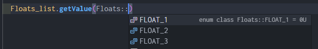
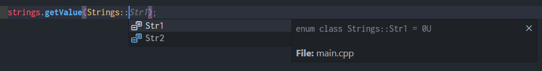

<h1 align="center">
  <a></a>
  <br>
  SettingsManagerESP32
</h1>

<p align="center">
  <b>Manage your ESP32 settings with ease!</b>
</p>

<p align="center">
  <a href="https://www.ardu-badge.com/SettingsManagerESP32">
    
  </a>
  <a href="https://registry.platformio.org/libraries/alkonosst/SettingsManagerESP32">
    
  </a>
  <br><br>
  <a href="https://ko-fi.com/alkonosst">
    
  </a>
</p>

---

# Table of contents <!-- omit in toc -->

- [Description](#description)
- [Usage](#usage)
  - [Adding library to Arduino IDE](#adding-library-to-arduino-ide)
  - [Adding library to platformio.ini (PlatformIO)](#adding-library-to-platformioini-platformio)
  - [Using the library](#using-the-library)
    - [Including the library](#including-the-library)
    - [What is inside the library](#what-is-inside-the-library)
  - [Constructors and initialization](#constructors-and-initialization)
    - [Step 1: Defining your settings in a macro](#step-1-defining-your-settings-in-a-macro)
    - [Step 2: Creating `enum class` and `Settings` object (manual)](#step-2-creating-enum-class-and-settings-object-manual)
    - [Step 2 alternative: Creating `enum class` and `Settings` object (automatic)](#step-2-alternative-creating-enum-class-and-settings-object-automatic)
    - [Initialization](#initialization)
    - [Full example](#full-example)
  - [Settings API](#settings-api)
    - [Reading and writing values](#reading-and-writing-values)
    - [Formatting](#formatting)
    - [Callbacks](#callbacks)
    - [Type-erased interface (`ISettings`)](#type-erased-interface-isettings)
  - [Setting types](#setting-types)
  - [Utility functions](#utility-functions)
  - [Important notes](#important-notes)
    - [String and ByteStream types](#string-and-bytestream-types)
    - [Migration from v3 to v4](#migration-from-v3-to-v4)
- [License](#license)

---

# Description

Manage your ESP32 device settings effortlessly with the **SettingsManagerESP32** library. Built on top of the ESP-IDF NVS API, it provides a clean and type-safe interface to store and retrieve your device settings in non-volatile storage.

Core features:

- Single place to define a group of settings using [X-Macros](https://en.wikipedia.org/wiki/X_macro).
- Each setting has a **Key**, a **Hint** (description text), and a **Default Value**. All metadata lives in flash - no heap usage.
- Access settings via a type-safe `enum class` instead of raw key strings.
- Each `Settings` object owns its own NVS namespace handle, allowing multiple independent groups or shared namespaces.
- Per-setting and global change callbacks.
- Full autocompletion support in IDEs like VS Code.




# Usage

## Adding library to Arduino IDE

Search for **SettingsManagerESP32** in the Library Manager.

## Adding library to platformio.ini (PlatformIO)

```ini
; Most recent changes
lib_deps =
  https://github.com/alkonosst/SettingsManagerESP32.git

; Specific release (recommended for production)
lib_deps =
  https://github.com/alkonosst/SettingsManagerESP32.git#v4.0.0
```

## Using the library

### Including the library

```cpp
#include "SettingsManagerESP32.h"
```

### What is inside the library

All classes and types live in the `NVS` namespace. The main pieces are:

**Classes:**

- `NVS::Settings<T, ENUM, N>` - typed container for a group of NVS settings under a single namespace.
  - `T` - value type (`bool`, `uint32_t`, `int32_t`, `float`, `double`, `NVS::Str`, `NVS::ByteStream`).
  - `ENUM` - enum class used to index settings.
  - `N` - number of settings (use `SETTINGS_COUNT(your_macro)`).
- `NVS::ISettings` - type-erased interface. Useful for storing heterogeneous `Settings` objects in an array.

**Types:**

| Type                      | Description                                                                                                             |
| ------------------------- | ----------------------------------------------------------------------------------------------------------------------- |
| `NVS::Str`                | Mutable string buffer for `getValue()`. Caller allocates the buffer.                                                    |
| `NVS::StrView`            | Read-only string view. Used for default values and `setValue()`. Implicitly constructed from `const char*`.             |
| `NVS::ByteStream`         | Mutable byte buffer for `getValue()`. Caller allocates the buffer.                                                      |
| `NVS::ByteStreamView`     | Read-only byte view. Used for default values and `setValue()`.                                                          |
| `NVS::ByteStream::Format` | Metadata enum: `Hex`, `Base64`, `JSONObject`, `JSONArray`. Not persisted in NVS.                                        |
| `NVS::Type`               | Identifies the value type of a `Settings` object: `Bool`, `UInt32`, `Int32`, `Float`, `Double`, `String`, `ByteStream`. |

**NVS partition lifecycle functions:**

```cpp
NVS::init();   // Initialize the default NVS flash partition. Call once in setup() before any begin().
NVS::deinit(); // Deinitialize the partition.
NVS::erase();  // Erase all data in the partition (requires init() again afterwards).
```

All three accept an optional `const char* partition_name` to target a custom partition.

## Constructors and initialization

The library uses [X-Macros](https://en.wikipedia.org/wiki/X_macro) to keep all settings in one place.

### Step 1: Defining your settings in a macro

```cpp
#define FLOATS(X)                                \
  X(SenThr,   "Sensor Threshold", 3.14,   false) \
  X(AdcSlope, "ADC Slope",        1.2345, true)  \
  X(Offset,   "ADC Offset",       0.0,    true)
```

Each row defines one setting:

| Field         | Description                                                                           |
| ------------- | ------------------------------------------------------------------------------------- |
| Name          | Becomes the enum enumerator and the NVS key string. Max 15 characters, no whitespace. |
| Hint          | Human-readable description.                                                           |
| Default value | Must match the type of the `Settings` object.                                         |
| Formattable   | `true` if `formatAll()` should reset this setting to its default.                     |

All settings in the same macro must be of the same type.

### Step 2: Creating `enum class` and `Settings` object (manual)

```cpp
enum class MyFloats : uint8_t { FLOATS(SETTINGS_EXPAND_ENUM_CLASS) };
NVS::Settings<float, MyFloats, SETTINGS_COUNT(FLOATS)> my_floats("esp32", {FLOATS(SETTINGS_EXPAND_SETTINGS)});
```

This expands to:

```cpp
enum class MyFloats : uint8_t { SenThr, AdcSlope, Offset };
NVS::Settings<float, MyFloats, 3> my_floats("esp32", {
  {"SenThr",   "Sensor Threshold", 3.14,   false},
  {"AdcSlope", "ADC Slope",        1.2345, true},
  {"Offset",   "ADC Offset",       0.0,    true},
});
```

### Step 2 alternative: Creating `enum class` and `Settings` object (automatic)

```cpp
SETTINGS_CREATE_FLOATS(Floats, "esp32", FLOATS)
```

| Parameter | Description                                         |
| --------- | --------------------------------------------------- |
| `Floats`  | Name for the enum class and the `st_Floats` object. |
| `"esp32"` | NVS namespace name (max 15 characters).             |
| `FLOATS`  | X-macro with the settings list.                     |

This creates `enum class Floats` and `NVS::Settings<float, Floats, N> st_Floats(...)`.

### Initialization

Before any read or write, initialize the NVS partition and open each `Settings` handle:

```cpp
void setup() {
  if (!NVS::init()) {
    // Handle error
  }

  if (!st_Floats.begin()) {
    // Handle error
  }
}
```

### Full example

```cpp
#include "SettingsManagerESP32.h"

#define UINT32S(X)              \
  X(UInt1, "uint32 1", 1, true) \
  X(UInt2, "uint32 2", 2, true) \
  X(UInt3, "uint32 3", 3, true)

#define FLOATS(X)                 \
  X(Float1, "float 1", 1.1, true) \
  X(Float2, "float 2", 2.2, true) \
  X(Float3, "float 3", 3.3, true)

// Manual creation
enum class Floats : uint8_t { FLOATS(SETTINGS_EXPAND_ENUM_CLASS) };
NVS::Settings<float, Floats, SETTINGS_COUNT(FLOATS)> float_settings("esp32", {FLOATS(SETTINGS_EXPAND_SETTINGS)});

// Automatic creation
SETTINGS_CREATE_UINT32S(UInt32s, "esp32", UINT32S)

void setup() {
  if (!NVS::init()) { /* handle error */ }
  if (!float_settings.begin()) { /* handle error */ }
  if (!st_UInt32s.begin()) { /* handle error */ }

  // Get the key string: "UInt1"
  const char* key = st_UInt32s.getKey(UInt32s::UInt1);

  // Write a value
  float_settings.setValue(Floats::Float1, 9.99f);

  // Read a value
  float val;
  if (float_settings.getValue(Floats::Float1, val)) {
    // val == 9.99f
  }
}
```

## Settings API

### Reading and writing values

```cpp
// Write
settings.setValue(MyEnum::Key, value);

// Read - returns true if the key exists in NVS, false if not yet saved
MyType val;
bool found = settings.getValue(MyEnum::Key, val);

// Get default value
auto def = settings.getDefaultValue(MyEnum::Key);

// Get key/hint strings
const char* key  = settings.getKey(MyEnum::Key);
const char* hint = settings.getHint(MyEnum::Key);
```

> [!NOTE]
> `getValue()` returns `false` when the key has not been saved to NVS yet. In that case, `val` is
> left **unchanged** - no default value is written to it. Check the return value and fall back to
> `getDefaultValue()` if needed.

### Formatting

"Formatting" means resetting a setting's NVS value back to its default.

```cpp
settings.format(MyEnum::Key);        // Reset one setting (respects the formattable flag)
settings.format(MyEnum::Key, true);  // Reset one setting (ignores the formattable flag)
settings.formatAll();                // Reset all formattable settings
settings.formatAll(true);            // Reset all settings regardless of the formattable flag
```

### Callbacks

Callbacks fire when a value is written via `setValue()` or `format()`.

```cpp
// Per-setting callback
// callable_on_format: whether to fire when a format operation writes this setting
settings.setOnChangeCallback(MyEnum::Key,
  [](const char* key, MyEnumType setting, MyWriteType value) {
    // handle change
  },
  /*callable_on_format=*/false);

// Global callback (fires for every setting change in this object)
// The value is passed as const void* - cast to WriteType* before use
settings.setGlobalOnChangeCallback(
  [](const char* key, NVS::Type type, size_t index, const void* value) {
    // handle change
  },
  /*callable_on_format=*/true);
```

For `NVS::Str`, the per-setting callback receives `NVS::StrView`. For `NVS::ByteStream`, it receives `NVS::ByteStreamView`.

### Type-erased interface (`ISettings`)

`NVS::ISettings*` lets you store heterogeneous `Settings` objects in a plain array and operate on them without knowing the value type:

```cpp
NVS::ISettings* all[] = {&st_Floats, &st_UInt32s, &st_Strings};

for (auto* s : all) {
  s->begin();
}

// Access by index
const char* key = all[0]->getKey(0);
NVS::Type type  = all[0]->getType();

// Read/write via void*
float f;
all[0]->getValuePtr(0, &f, sizeof(f));

float new_val = 1.23f;
all[0]->setValuePtr(0, &new_val);
```

## Setting types

```cpp
// Boolean
#define BOOLS(X)                     \
  X(Bool1, "boolean 1", false, true) \
  X(Bool2, "boolean 2", true,  true)

SETTINGS_CREATE_BOOLS(Bools, "esp32", BOOLS)

// Unsigned 32-bit integer
#define UINT32S(X)              \
  X(UInt1, "uint32 1", 1, true) \
  X(UInt2, "uint32 2", 2, true)

SETTINGS_CREATE_UINT32S(UInt32s, "esp32", UINT32S)

// Signed 32-bit integer
#define INT32S(X)               \
  X(Int1, "int32 1", -1, true)  \
  X(Int2, "int32 2", -2, true)

SETTINGS_CREATE_INT32S(Int32s, "esp32", INT32S)

// Float
#define FLOATS(X)                 \
  X(Float1, "float 1", 1.1, true) \
  X(Float2, "float 2", 2.2, true)

SETTINGS_CREATE_FLOATS(Floats, "esp32", FLOATS)

// Double
#define DOUBLES(X)                         \
  X(Double1, "double 1", 1.123456, true)   \
  X(Double2, "double 2", 2.123456, true)

SETTINGS_CREATE_DOUBLES(Doubles, "esp32", DOUBLES)

// String - default values are StrView, constructed from a string literal
#define STRINGS(X)                      \
  X(Str1, "string 1", "default 1", true) \
  X(Str2, "string 2", "default 2", true)

SETTINGS_CREATE_STRINGS(Strings, "esp32", STRINGS)

// ByteStream - default values are ByteStreamView; data must remain valid for the object's lifetime
const uint8_t bs1_data[]          = {0xDE, 0xAD, 0xBE, 0xEF};
const NVS::ByteStreamView bs1_def = {bs1_data, sizeof(bs1_data), NVS::ByteStream::Format::Hex};

const uint8_t bs2_data[]          = {0x01, 0x02, 0x03, 0x04};
const NVS::ByteStreamView bs2_def = {bs2_data, sizeof(bs2_data), NVS::ByteStream::Format::Hex};

#define BYTESTREAMS(X)                       \
  X(BS1, "byte stream 1", bs1_def, true)     \
  X(BS2, "byte stream 2", bs2_def, true)

SETTINGS_CREATE_BYTE_STREAMS(ByteStreams, "esp32", BYTESTREAMS)
```

## Utility functions

All utility functions are in the `NVS` namespace.

```cpp
// Convert a Type enum to a string ("Bool", "Float", "String", etc.)
const char* NVS::typeToStr(NVS::Type t);

// Convert a ByteStream::Format enum to a string ("Hex", "Base64", etc.)
const char* NVS::formatToStr(NVS::ByteStream::Format f);

// Calculate the buffer size needed to hold the hex string for byte_count bytes
// Without spaces: "DEADBEEF\0"  → hexStrSize(4)       = 9
// With spaces:    "DE AD BE EF\0" → hexStrSize(4, true) = 12
constexpr size_t NVS::hexStrSize(size_t byte_count, bool with_spaces = false);

// Encode a ByteStreamView to a hex string
// buf must hold at least hexStrSize(bs.size, with_spaces) bytes
bool NVS::fromHexToStr(NVS::ByteStreamView bs, char* buf, size_t buf_size, bool with_spaces = false);

// Decode a hex string into a ByteStream buffer; out.size is updated on success
bool NVS::fromStrToHex(const char* hex, NVS::ByteStream& out, bool with_spaces = false);
```

Example:

```cpp
uint8_t buf[32];
NVS::ByteStream value{buf, sizeof(buf)};
bytestreams.getValue(ByteStreams::BS1, value);

char hex_compact[NVS::hexStrSize(32)];
char hex_spaced[NVS::hexStrSize(32, true)];
NVS::fromHexToStr(value, hex_compact, sizeof(hex_compact));          // "DEADBEEF"
NVS::fromHexToStr(value, hex_spaced,  sizeof(hex_spaced),  true);   // "DE AD BE EF"

// Decode back
NVS::ByteStream decoded{buf, sizeof(buf)};
NVS::fromStrToHex("CAFEBABE", decoded);
NVS::fromStrToHex("CA FE BA BE", decoded, true);
```

## Important notes

### String and ByteStream types

`NVS::Str` and `NVS::ByteStream` require the **caller to provide a buffer** before calling `getValue()`. The library writes directly into that buffer - no heap allocation, no shared internal buffer, and no mutex needed.

**Strings:**

```cpp
// Default values use StrView - implicitly constructed from const char*
// No extra declaration needed in the macro

// Reading a string value
char buf[64];
NVS::Str out{buf, sizeof(buf)};
if (strings.getValue(Strings::Str1, out)) {
  Serial.println(out.data);
}

// Writing a string value (StrView is constructed implicitly)
strings.setValue(Strings::Str1, "new value");

// Getting the default value
NVS::StrView def = strings.getDefaultValue(Strings::Str1);
Serial.println(def.data);
```

**ByteStreams:**

```cpp
// Default values - must declare ByteStreamView (data pointer must outlive the Settings object)
const uint8_t my_data[]          = {0xDE, 0xAD, 0xBE, 0xEF};
const NVS::ByteStreamView my_def = {my_data, sizeof(my_data), NVS::ByteStream::Format::Hex};

// Reading a ByteStream value
uint8_t buf[32];
NVS::ByteStream out{buf, sizeof(buf)};
if (bytestreams.getValue(ByteStreams::BS1, out)) {
  // out.data contains the bytes, out.size is the number of bytes read
}

// Writing a ByteStream value (ByteStreamView)
const uint8_t new_data[]             = {0xCA, 0xFE, 0xBA, 0xBE};
const NVS::ByteStreamView new_value  = {new_data, sizeof(new_data), NVS::ByteStream::Format::Hex};
bytestreams.setValue(ByteStreams::BS1, new_value);

// Or use the implicit conversion from ByteStream to ByteStreamView
NVS::ByteStream writable{buf, sizeof(buf)};
// ... fill buf ...
bytestreams.setValue(ByteStreams::BS1, writable); // implicit conversion
```

> [!NOTE]
> The `ByteStream::Format` field is metadata only - it is **not persisted in NVS**. Use it as a
> hint to know how to interpret the raw bytes when displaying or transmitting them.

### Migration from v3 to v4

The previous v3 release can be found at [v3.1.0](https://github.com/alkonosst/SettingsManagerESP32/tree/v3.1.0).

v4 is a full rewrite with several breaking changes:

| Area                         | v3                         | v4                                                 |
| ---------------------------- | -------------------------- | -------------------------------------------------- |
| NVS backend                  | Arduino `Preferences`      | ESP-IDF `nvs.h`                                    |
| Global NVS object            | `Preferences nvs` (global) | `NVS::init()` / `NVS::deinit()`                    |
| Handle lifecycle             | `nvs.begin("ns")` (global) | `settings.begin()` per object                      |
| Namespace                    | Shared single namespace    | Each `Settings` object owns its namespace          |
| `SETTINGS_CREATE_XXX` params | `(name, macro)`            | `(name, ns, macro)`                                |
| String type                  | `const char*`              | `NVS::Str` (read) / `NVS::StrView` (write/default) |
| ByteStream default           | `const NVS::ByteStream`    | `const NVS::ByteStreamView`                        |
| `getValue()` on miss         | Wrote default to out-param | Leaves out-param **unchanged**, returns `false`    |
| Mutex for strings            | `giveMutex()` required     | Not needed - caller provides the buffer            |
| Shared internal buffer       | Yes (strings/bytestreams)  | No - caller-owned buffers throughout               |

**Minimal migration steps:**

1. Replace `nvs.begin("ns")` with `NVS::init()` + `settings.begin()`.
2. Add the namespace string as the second parameter to all `SETTINGS_CREATE_XXX` calls.
3. Change string default values from `"str"` to `NVS::StrView{"str"}` (or keep the string literal - it converts implicitly).
4. Change ByteStream default values from `const NVS::ByteStream{...}` to `const NVS::ByteStreamView{...}`.
5. Change string read variables from `const char*` to `NVS::Str{buf, sizeof(buf)}` with a caller-owned buffer.
6. Change bytestream read variables to `NVS::ByteStream{buf, sizeof(buf)}` with a caller-owned buffer.
7. Remove all `giveMutex()` calls.
8. If you relied on `getValue()` filling `out` with the default on a miss, add an explicit fallback.

# License

This project is licensed under the MIT License - see the [LICENSE](LICENSE) file for details.
