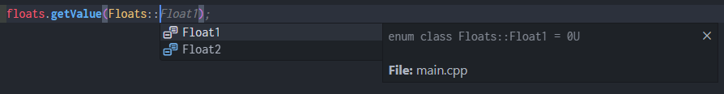

<h1 align="center">
  <a></a>
  <br>
  SettingsManagerESP32
</h1>

<p align="center">
  <b>Manage your ESP32 Preferences easily!</b>
</p>

---

## Table of contents <!-- omit in toc -->

- [Description](#description)
- [Usage](#usage)
  - [Adding library to platformio.ini (PlatformIO)](#adding-library-to-platformioini-platformio)
  - [Constructors and initialization](#constructors-and-initialization)
    - [Step 1: Defining your settings in a macro](#step-1-defining-your-settings-in-a-macro)
    - [Step 2: Creating `enum class` and `settings list` (automatic)](#step-2-creating-enum-class-and-settings-list-automatic)
    - [Step 2 alternative: Creating `enum class` and `settings list` (manual)](#step-2-alternative-creating-enum-class-and-settings-list-manual)
    - [Example](#example)
  - [Setting types](#setting-types)
  - [Methods](#methods)
    - [`getKey()`](#getkey)
    - [`getText()`](#gettext)
    - [`getDefaultValue()`](#getdefaultvalue)
    - [`setValue()`](#setvalue)
    - [`getValue()`](#getvalue)
    - [`getType()`](#gettype)
    - [`format()`](#format)
    - [`getSize()`](#getsize)
  - [Using pointers](#using-pointers)
    - [Creating pointers to Settings](#creating-pointers-to-settings)
    - [Formatting all settings](#formatting-all-settings)
    - [Access all setting values](#access-all-setting-values)

---

## Description

Manage your ESP32 device preferences effortlessly with the **SettingsManagerESP32** library. This
powerful yet user-friendly library abstracts away the complexities of dealing with ESP32
Non-Volatile Storage, providing you with a seamless and intuitive interface to store and retrieve
your device settings.

Some of the core features are:

- Single place to manage a list of settings in your code.
- Capable of having a **Key**, **Description Text** and a **Default Value** for each setting. All
  these values stored in flash, no use of the heap.
- No need to use a key string to access a setting (_default case in the Preferences library_).
- Use of automatically created enum class to index your settings.
- Perfect use with a IDE with autocompletion, like VSCode. See example below.




## Usage

### Adding library to platformio.ini (PlatformIO)

```ini
; Most recent changes
lib_deps =
  https://github.com/alkonosst/SettingsManagerESP32.git

; Release vx.y.z (recommended)
lib_deps =
  https://github.com/alkonosst/SettingsManagerESP32.git#v1.0.0
```

### Constructors and initialization

This library makes use of [X-Macros](https://en.wikipedia.org/wiki/X_macro) to make the code
maintainable and escalable. You can easily add, edit or remove a setting in the same place.

#### Step 1: Defining your settings in a macro

In order to create a new group of settings, you need to define a macro with the following structure:

```cpp
#define FLOATS(X) \
  X(SEN_THR, "Sensor Voltage Threshold", 3.14) \
  X(ADC_SLOPE, "ADC Slope Factor", 1.2345)     \
```

|      | First                                                                                          | Second                                  | Third                                                         |     |
| ---- | ---------------------------------------------------------------------------------------------- | --------------------------------------- | ------------------------------------------------------------- | --- |
| `X(` | Enum class member, also used as a key (**no more than 15 characters** and **no whitespaces**). | Text to describe what the setting does. | Default value. In the example above, a value of type `float`. | `)` |

Each new row is a new setting. All settings in the same macro must be of the same
type. In the example above all settings are `float`.

#### Step 2: Creating `enum class` and `settings list` (automatic)

After your macro with settings is defined, you must use the corresponding `SETTINGS_CREATE_XXX`
macro (_refer to [Setting types](#setting-types) to see all macros_).
This will create a automatically a `enum class` and a `setting` object to use later.

```cpp
SETTINGS_CREATE_FLOATS(Floats, FLOATS)
```

|                           | First                                                             | Second                                    |     |
| ------------------------- | ----------------------------------------------------------------- | ----------------------------------------- | --- |
| `SETTINGS_CREATE_FLOATS(` | A name to give to the `enum class` and prefix to `settings list`. | X-Macro with settings defined previously. | `)` |

The example above with expand to this:

```cpp
enum class Floats : uint8_t { FLOATS(SETTINGS_EXPAND_ENUM_CLASS) };
SettingsFloat<Floats> Floats##_list = { FLOATS(SETTINGS_EXPAND_SETTINGS) };
```

And finally will expand to this:

```cpp
enum class Floats : uint8_t { SEN_THR, ADC_SLOPE };
SettingsFloat<Floats> Floats_list = {
  {"SEN_THR",   "Sensor Voltage Threshold", 3.14  },
  {"ADC_SLOPE", "ADC Slope Factor",         1.2345}
};
```

Now you can use the `Floats_list` object and the `Floats` enum class.

#### Step 2 alternative: Creating `enum class` and `settings list` (manual)

Alternatively, you can set the `enum class` and `settings list` names separately. You must use the
macros `SETTINGS_EXPAND_ENUM_CLASS` and `SETTINGS_EXPAND_SETTINGS` as argument to your X-Macro
defined previously, as shown below:

```cpp
enum class MyFloatList : uint8_t { FLOATS(SETTINGS_EXPAND_ENUM_CLASS) };
SettingsFloat<MyFloatList> my_float_settings = { FLOATS(SETTINGS_EXPAND_SETTINGS) };
```

This will expand to this:

```cpp
enum class MyFloats : uint8_t { SEN_THR, ADC_SLOPE };
SettingsFloat<MyFloats> my_float_settings = {
  {"SEN_THR",   "Sensor Voltage Threshold", 3.14  },
  {"ADC_SLOPE", "ADC Slope Factor",         1.2345}
};
```

Now you can use the `my_float_settings` object and the `MyFloats` enum class.

#### Example

```cpp
#include "SettingsManagerESP32.h" // Include library

// Step 1: Define the X-Macro.
// - The macro's name can be whatever you prefer. In this case "UINT32S", because we will store a
// group of settings of type uint32_t.
#define UINT32S(X)           \
  X(UINT32_1, "uint32 1", 1) \
  X(UINT32_2, "uint32 2", 2) \
  X(UINT32_3, "uint32 3", 3)

// The argument "X" can be named as you wish, but remember to use it in every row for each new setting.
#define FLOATS(setting)            \
  setting(FLOAT_1, "float 1", 1.1) \
  setting(FLOAT_2, "float 2", 2.2) \
  setting(FLOAT_3, "float 3", 3.3)

// Step 2: Creating enum class and settings list automatically
SETTINGS_CREATE_UINT32S(UInt32s, UINT32S)

// Step 2 alternative: Creating enum class and settings list manually
enum class Floats { FLOATS(SETTINGS_EXPAND_ENUM_CLASS) };
SettingsFloat<Floats> float_settings = { FLOATS(SETTINGS_EXPAND_SETTINGS) };

void setup() {
  // Initialize NVS with namespace "esp32"
  nvs.begin("esp32");

  /* Now you could access to the settings methods */

  // You should obtain "UINT32_1"
  const char* uint32_1_key = UInt32s_list.getKey(UInt32s::UINT32_1);

  // You should obtain "FLOAT_1"
  const char* float_1_key  = float_settings.getKey(Floats::FLOAT_1);
}
```

### Setting types

```cpp
#define FLAGS(X)             \
  X(FLAG_1, "flag 1", false) \
  X(FLAG_2, "flag 2", true)  \
  X(FLAG_3, "flag 3", false)

#define UINT32S(X)           \
  X(UINT32_1, "uint32 1", 1) \
  X(UINT32_2, "uint32 2", 2) \
  X(UINT32_3, "uint32 3", 3)

#define INT32S(X)           \
  X(INT32_1, "int32 1", -1) \
  X(INT32_2, "int32 2", -2) \
  X(INT32_3, "int32 3", -3)

#define FLOATS(X)            \
  X(FLOAT_1, "float 1", 1.1) \
  X(FLOAT_2, "float 2", 1.2) \
  X(FLOAT_3, "float 3", 1.3)

#define DOUBLES(X)                  \
  X(DOUBLE_1, "double 1", 1.123456) \
  X(DOUBLE_2, "double 2", 2.123456) \
  X(DOUBLE_3, "double 3", 3.123456)

#define STRINGS(X)                 \
  X(STRING_1, "string 1", "str 1") \
  X(STRING_2, "string 2", "str 2") \
  X(STRING_3, "string 3", "str 3")

// Automatic creation
SETTINGS_CREATE_FLAGS(Flags, FLAGS)       // Boolean
SETTINGS_CREATE_UINT32S(UInt32s, UINT32S) // Unsigned 32 bit integer
SETTINGS_CREATE_INT32S(Int32s, INT32S)    // Signed 32 bit integer
SETTINGS_CREATE_FLOATS(Floats, FLOATS)    // Floating-point
SETTINGS_CREATE_DOUBLES(Doubles, DOUBLES) // Double precision floating-point
SETTINGS_CREATE_STRINGS(Strings, STRINGS) // String, array of characters
```

### Methods

#### `getKey()`

```cpp
// Using enum class
const char* flag_1_key   = Flags_list.getKey(Flags::FLAG_1);       // "FLAG_1"
const char* uint32_1_key = UInt32s_list.getKey(UInt32s::UINT32_1); // "UINT32_1"
const char* int32_1_key  = Int32s_list.getKey(Int32s::INT32_1);    // "INT32_1"
const char* float_1_key  = Floats_list.getKey(Floats::FLOAT_1);    // "FLOAT_1"
const char* double_1_key = Doubles_list.getKey(Doubles::DOUBLE_1); // "DOUBLE_1"
const char* string_1_key = Strings_list.getKey(Strings::STRING_1); // "STRING_1"

// Using index. If index >= list size, it will return nullptr
const char* flag_1_key   = Flags_list.getKey(0);   // "FLAG_1"
const char* uint32_1_key = UInt32s_list.getKey(0); // "UINT32_1"
const char* int32_1_key  = Int32s_list.getKey(0);  // "INT32_1"
const char* float_1_key  = Floats_list.getKey(0);  // "FLOAT_1"
const char* double_1_key = Doubles_list.getKey(0); // "DOUBLE_1"
const char* string_1_key = Strings_list.getKey(0); // "STRING_1"
```

#### `getText()`

```cpp
// Using enum class
const char* flag_1_text   = Flags_list.getText(Flags::FLAG_1);       // "flag 1"
const char* uint32_1_text = UInt32s_list.getText(UInt32s::UINT32_1); // "uint32 1"
const char* int32_1_text  = Int32s_list.getText(Int32s::INT32_1);    // "int32 1"
const char* float_1_text  = Floats_list.getText(Floats::FLOAT_1);    // "float 1"
const char* double_1_text = Doubles_list.getText(Doubles::DOUBLE_1); // "double 1"
const char* string_1_text = Strings_list.getText(Strings::STRING_1); // "string 1"

// Using index. If index >= list size, it will return nullptr
const char* flag_1_text   = Flags_list.getText(0);   // "flag 1"
const char* uint32_1_text = UInt32s_list.getText(0); // "uint32 1"
const char* int32_1_text  = Int32s_list.getText(0);  // "int32 1"
const char* float_1_text  = Floats_list.getText(0);  // "float 1"
const char* double_1_text = Doubles_list.getText(0); // "double 1"
const char* string_1_text = Strings_list.getText(0); // "string 1"
```

#### `getDefaultValue()`

```cpp
// Using enum class
bool flag_1_default_value          = Flags_list.getDefaultValue(Flags::FLAG_1);       // false
uint32_t uint32_1_default_value    = UInt32s_list.getDefaultValue(UInt32s::UINT32_1); // 1
int32_t int32_1_default_value      = Int32s_list.getDefaultValue(Int32s::INT32_1);    // -1
float float_1_default_value        = Floats_list.getDefaultValue(Floats::FLOAT_1);    // 1.1
double double_1_default_value      = Doubles_list.getDefaultValue(Doubles::DOUBLE_1); // 1.123456
const char* string_1_default_value = Strings_list.getDefaultValue(Strings::STRING_1); // "str 1"

// Using index. If index >= list size, it will return nullptr
bool flag_1_text          = Flags_list.getDefaultValue(0);   // false
uint32_t uint32_1_text    = UInt32s_list.getDefaultValue(0); // 1
int32_t int32_1_text      = Int32s_list.getDefaultValue(0);  // -1
float float_1_text        = Floats_list.getDefaultValue(0);  // 1.1
double double_1_text      = Doubles_list.getDefaultValue(0); // 1.123456
const char* string_1_text = Strings_list.getDefaultValue(0); // "str 1"
```

#### `setValue()`

```cpp
bool flag_1_saved   = Flags_list.setValue(Flags::FLAG_1, true);
bool uint32_1_saved = UInt32s_list.setValue(UInt32s::UINT32_1, 100);
bool int32_1_saved  = Int32s_list.setValue(Int32s::INT32_1, -100);
bool float_1_saved  = Floats_list.setValue(Floats::FLOAT_1, 3.14);
bool double_1_saved = Doubles_list.setValue(Doubles::DOUBLE_1, 123.456);
bool string_1_saved = Strings_list.setValue(Strings::STRING_1, "hello world");
```

#### `getValue()`

```cpp
bool flag_1_value       = Flags_list.getValue(Flags::FLAG_1);       // true
uint32_t uint32_1_value = UInt32s_list.getValue(UInt32s::UINT32_1); // 100
int32_t int32_1_value   = Int32s_list.getValue(Int32s::INT32_1);    // -100
float float_1_value     = Floats_list.getValue(Floats::FLOAT_1);    // 3.14
double double_1_value   = Doubles_list.getValue(Doubles::DOUBLE_1); // 123.456
String string_1_value   = Strings_list.getValue(Strings::STRING_1); // "hello world"
```

#### `getType()`

```cpp
SettingsType flag_type   = Flags_list.getType();   // SettingsType::FLAG
SettingsType uint32_type = UInt32s_list.getType(); // SettingsType::UINT32
SettingsType int32_type  = Int32s_list.getType();  // SettingsType::INT32
SettingsType float_type  = Floats_list.getType();  // SettingsType::FLOAT
SettingsType double_type = Doubles_list.getType(); // SettingsType::DOUBLE
SettingsType string_type = Strings_list.getType(); // SettingsType::STRING
```

#### `format()`

```cpp
size_t flag_format_errors   = Flags_list.format();
size_t uint32_format_errors = UInt32s_list.format();
size_t int32_format_errors  = Int32s_list.format();
size_t float_format_errors  = Floats_list.format();
size_t double_format_errors = Doubles_list.format();
size_t string_format_errors = Strings_list.format();
```

#### `getSize()`

```cpp
size_t flag_size   = Flags_list.getSize();   // 3
size_t uint32_size = UInt32s_list.getSize(); // 3
size_t int32_size  = Int32s_list.getSize();  // 3
size_t float_size  = Floats_list.getSize();  // 3
size_t double_size = Doubles_list.getSize(); // 3
size_t string_size = Strings_list.getSize(); // 3
```

### Using pointers

If you need to group different settings to iterate them easily, you can use the `Settings` interface
class to create a pointer to a particular Setting object.

#### Creating pointers to Settings

```cpp
// Single pointer to Flags
Settings* ptr_flags = &Flags_list;

// Array of pointers to all settings, with the memory address of each unique Setting List
Settings* settings[] = {&Flags_list,
                        &UInt32s_list,
                        &Int32s_list,
                        &Floats_list,
                        &Doubles_list,
                        &Strings_list};

// Size: 6
constexpr size_t settings_size = sizeof(settings) / sizeof(settings[0]);
```

#### Formatting all settings

```cpp
for (size_t i = 0; i < settings_size; i++) {
  settings[i]->format();
}
```

#### Access all setting values

```cpp
// Iterate all setting pointers
for (size_t setting = 0; setting < settings_size; setting++) {

  // Iterate all setting members
  for (size_t i = 0; i < settings[setting]->getSize(); i++) {

    // Access to key and text are common to all Types
    const char* key  = settings[setting]->getKey(i);
    const char* text = settings[setting]->getText(i);

    switch (settings[setting]->getType()) {
      case SettingsType::FLAG:
      {
        // Default value
        bool default_value = settings[setting]->getDefaultValueAs<bool>(i);

        // Current value
        bool value;
        settings[setting]->getValuePtr(i, &value);
      } break;

      case SettingsType::UINT32:
      {
        // Default value
        uint32_t default_value = settings[setting]->getDefaultValueAs<uint32_t>(i);

        // Current value
        uint32_t value;
        settings[setting]->getValuePtr(i, &value);
      } break;

      case SettingsType::INT32:
      {
        // Default value
        int32_t default_value = settings[setting]->getDefaultValueAs<int32_t>(i);

        // Current value
        int32_t value;
        settings[setting]->getValuePtr(i, &value);
      } break;

      case SettingsType::FLOAT:
      {
        // Default value
        float default_value = settings[setting]->getDefaultValueAs<float>(i);

        // Current value
        float value;
        settings[setting]->getValuePtr(i, &value);
      } break;

      case SettingsType::DOUBLE:
      {
        // Default value
        double default_value = settings[setting]->getDefaultValueAs<double>(i);

        // Current value
        double value;
        settings[setting]->getValuePtr(i, &value);
      } break;

      case SettingsType::STRING:
      {
        // Default value
        const char* default_value = settings[setting]->getDefaultValueAs<const char*>(i);

        // Current value
        char value[64]; // Adjust the size based on the longest string and give it extra room
        settings[setting]->getValuePtr(i, value);
      } break;
    }
  }
}
```
